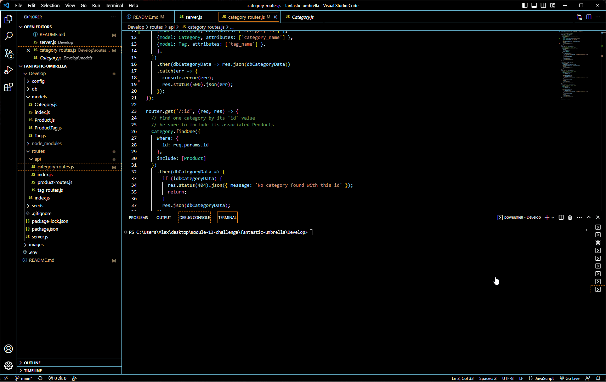

# Object-Relational Mapping (ORM) Challenge: E-commerce Back End

## Description
        
built the back end for an e-commerce site. Took a working Express.js API and configure it to use Sequelize to interact with a MySQL database.

 

## Table of Contents
- [Installation](#installation-installation)
- [Usage](#usage-usage)
- [License](#license-license)
- [Contributing](#contributing-contributing)
- [Tests](#tests-tests)
- [Questions](#questions-questions)
        
## Installation {#installation}
        
To install first you want to run "npm start", then "node seeds" to seed the tables.

## Usage {#usage}
        
To use appliaction make sure it listening to a local host port 3001, then using insomnia use post,get,delete,update and your destination url and click send.
        
## License {#license}
        
None
        
## Contributing {#contributing}
        
Don't contribute
        
## Tests {#tests}
        
Run debug in package.json, also  inosomnia can be used to test if routes are working and returns correct data.
        
## Questions {#questions}
If you have any questions, please feel free to contact me at Alex.Horning.54@gmail.com 
or check out my GitHub profile at [Makeitouthill](https://github.com/Makeitouthill).